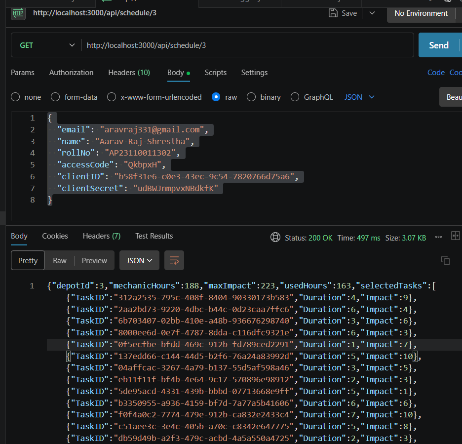

# Backend Assignment

## Overview

This repository is a Node.js Express backend for a vehicle maintenance scheduling microservice.

## Setup

1. Clone the repository.
2. Install dependencies.
3. Create a `.env` file in the project root.
4. Start the server.

## Install

```bash
npm install
```

## Run

```bash
npm run dev
```

or

```bash
node src/server.js
```

## Environment

Create a `.env` file with values such as:

```env
PORT=3000
BASE_URL=https://example.com
CLIENT_ID=
CLIENT_SECRET=
ACCESS_TOKEN=
```

## API Endpoints

### Health check

- `GET /`
- Response: `{ success: true, message: "server running" }`

### Users

- `GET /api/users`
- Response: `{ success: true, data: [] }`

### Depot data

- `GET /api/depot`
- Returns depot information used by the scheduling service.

### Vehicles

- `GET /api/vehicles`
- Returns vehicle information.

### Schedule

- `GET /api/schedule/:id`
- Example: `GET /api/schedule/1`
- Response includes `depotId`, `mechanicHours`, `maxImpact`, `usedHours`, and `selectedTasks`.

## Screenshots

To add screenshots to this README:

1. Create a folder called `screenshots/` in the project root.
2. Save image files there, for example `screenshots/health-check.png`.
3. Reference the image in Markdown:

```md

```

### Example

```md

```

## Notes

- If you want to include actual screenshots in GitHub, upload the image files to the repo and then reference them in the README.
- For local preview, use a Markdown viewer or GitHub.
